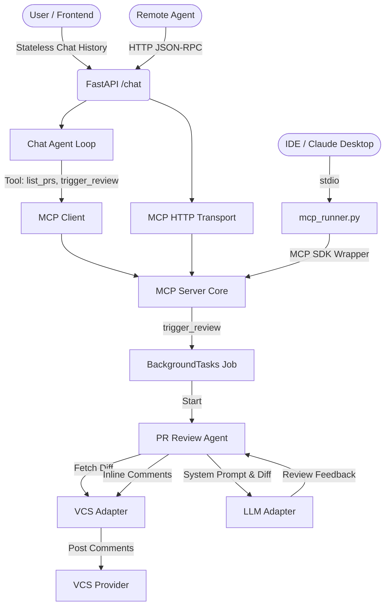

# Architecture Overview

This repository contains the source code for an AI-powered Pull Request Review Agent built in pure Python. The agent operates without external agentic frameworks, enforcing a custom, highly-controlled interaction loop and manual integrations.

## Core System Design: Two-Tier Architecture

The application has been restructured to support a **Human-in-the-Loop (HITL)** conversational pattern. Instead of blindly reviewing PRs on a webhook trigger, users converse with a Chat Agent to query PRs, get summaries, and authorize deep reviews.

## Architectural Components

### 1. Webhook Receiver (`/webhook`)
- **Technology**: FastAPI
- **Responsibility**: Listens for incoming POST requests from the VCS provider. In the current HITL architecture, this acts merely as a notification mechanism (which can later emit WebSockets to a frontend) rather than auto-triggering deep reviews.

### 2. Conversational API (`/chat`)
- **Technology**: FastAPI
- **Responsibility**: A stateless endpoint that accepts conversation history from the user. It routes this history to the `ChatAgent`.

### 3. Chat Agent (`core/chat_agent.py`)
- **Technology**: Raw Python ReAct Loop.
- **Responsibility**: Acts as an interactive assistant. It interprets user commands (e.g., "List PRs", "Review PR #5") and utilizes MCP tools to fetch GitHub data or spawn the background deep review task.

### 4. PR Review Agent (`core/agent.py`)
- **Technology**: Raw Python ReAct Loop.
- **Responsibility**: Runs asynchronously in the background. It takes a specific PR diff, analyzes it, and posts the final JSON-structured feedback directly to the VCS platform.

### 5. Transport-Agnostic MCP Server & Tools
- **Technology**: Core logic decoupled from transports; official Python MCP SDK for stdio, raw JSON-RPC for HTTP.
- **Responsibility**: Exposes repository and review tools (`read_file`, `list_prs`, `trigger_review`) securely.
- **Transports**:
  - **HTTP (`mcp_server/http_transport.py`)**: A stateless FastAPI endpoint (`/mcp`) that accepts JSON-RPC over HTTP, ideal for remote agents or simple web clients.
  - **stdio (`mcp_server/stdio_transport.py`)**: Wraps the core server with the official MCP SDK, enabling direct discovery and invocation from local IDEs (Cursor, VS Code) and Claude Desktop via `mcp_runner.py`.

### 6. Adapter Layer
- **VCS Adapters** (`adapters/vcs/`): Interfaces for interacting with repositories (GitHub, GitLab).
- **LLM Adapters** (`adapters/llm/`): Interfaces for executing prompts and generating responses (OpenAI, Anthropic, Gemini, GitHub Models).
