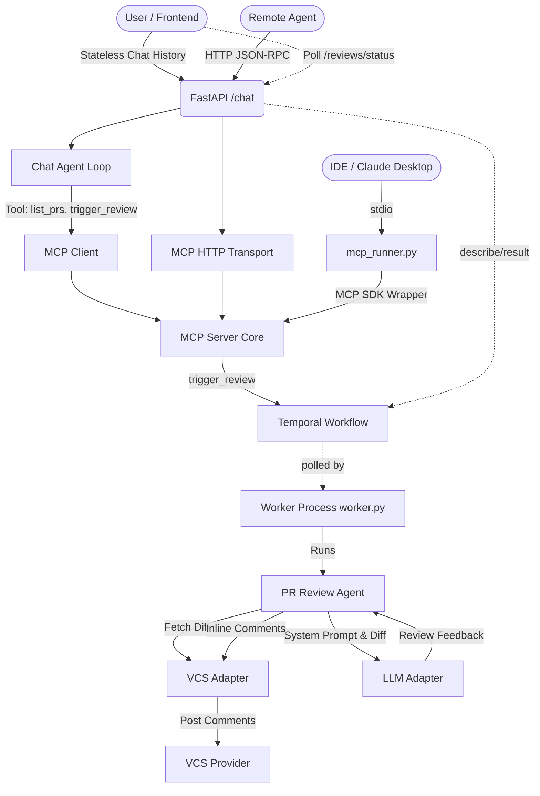

# Architecture Overview

This repository contains the source code for an AI-powered Pull Request Review Agent built in pure Python. The agent operates without external agentic frameworks, enforcing a custom, highly-controlled interaction loop and manual integrations.

## Core System Design: Two-Tier Architecture

The application has been restructured to support a **Human-in-the-Loop (HITL)** conversational pattern. Instead of blindly reviewing PRs on a webhook trigger, users converse with a Chat Agent to query PRs, get summaries, and authorize deep reviews.

```mermaid
graph TD
    User([User / Frontend]) -->|Stateless Chat History| A(FastAPI /chat)
    IDE([IDE / Claude Desktop]) -->|stdio| M2[mcp_runner.py]
    RemoteAgent([Remote Agent]) -->|HTTP JSON-RPC| A

    A --> B[Chat Agent Loop]
    A --> M1[MCP HTTP Transport]

    B -->|Tool: list_prs, trigger_review| C[MCP Client]
    C --> D[MCP Server Core]
    M1 --> D
    M2 -->|MCP SDK Wrapper| D

    D -->|trigger_review| W[Temporal Workflow]
    W -.->|polled by| N[Worker Process worker.py]
    N -->|Runs| F[PR Review Agent]

    F -->|Fetch Diff| G[VCS Adapter]
    F -->|System Prompt & Diff| H[LLM Adapter]
    H -->|Review Feedback| F
    F -->|Inline Comments| G
    G -->|Post Comments| I[VCS Provider]

    User -.->|Poll /reviews/status| A
    A -.->|describe/result| W
```

**Note on the trigger path**: there is no direct REST endpoint to trigger a review.
It's conversational — the user asks the Chat Agent to review a PR, the LLM calls
the `trigger_review` MCP tool, and `main.py:_start_review_workflow` starts a
durable Temporal workflow (`PRReviewWorkflow`, `core/temporal_workflows.py`). The
workflow itself only executes once a separate `worker.py` process (registered
against the same task queue) picks it up — see "Execution Model" below.

## Architectural Components

### 1. Webhook Receiver (`/webhook`)
- **Technology**: FastAPI
- **Responsibility**: Listens for incoming POST requests from the VCS provider. In the current HITL architecture, this acts merely as a notification mechanism (which can later emit WebSockets to a frontend) rather than auto-triggering deep reviews.

### 2. Conversational API (`/chat`)
- **Technology**: FastAPI
- **Responsibility**: A stateless endpoint that accepts conversation history from the user. It routes this history to the `ChatAgent`.

### 3. Chat Agent (`core/chat_agent.py`)
- **Technology**: Raw Python ReAct Loop.
- **Responsibility**: Acts as an interactive assistant. It interprets user commands (e.g., "List PRs", "Review PR #5") and utilizes MCP tools to fetch GitHub data or spawn the background deep review task.

### 4. PR Review Agent (`core/agent.py`)
- **Technology**: Raw Python ReAct Loop.
- **Responsibility**: Runs asynchronously in the background. It takes a specific PR diff, analyzes it, and posts the final JSON-structured feedback directly to the VCS platform.

### 5. Transport-Agnostic MCP Server & Tools
- **Technology**: Core logic decoupled from transports; official Python MCP SDK for stdio, raw JSON-RPC for HTTP.
- **Responsibility**: Exposes repository and review tools (`read_file`, `list_prs`, `trigger_review`) securely.
- **Transports**:
  - **HTTP (`mcp_server/http_transport.py`)**: A stateless FastAPI endpoint (`/mcp`) that accepts JSON-RPC over HTTP, ideal for remote agents or simple web clients.
  - **stdio (`mcp_server/stdio_transport.py`)**: Wraps the core server with the official MCP SDK, enabling direct discovery and invocation from local IDEs (Cursor, VS Code) and Claude Desktop via `mcp_runner.py`.

### 6. Adapter Layer
- **VCS Adapters** (`adapters/vcs/`): Interfaces for interacting with repositories (GitHub, GitLab).
- **LLM Adapters** (`adapters/llm/`): Interfaces for executing prompts and generating responses (OpenAI, Anthropic, Gemini, GitHub Models).

## Execution Model: Temporal Workflow, Not In-Process Background Tasks

Deep reviews used to run as an in-process daemon thread per review
(`core/review_jobs.py`, now removed). They now run as a **durable Temporal
workflow** (`core/temporal_workflows.py: PRReviewWorkflow`), which requires
**three separate processes** to be running (see `README.md` Setup for exact
commands):

1. **The FastAPI app** (`main.py`) — serves `/chat`, `/reviews/status`, `/reviews/cancel`.
2. **A Temporal server** (e.g. `temporal server start-dev`) — durable workflow/activity state.
3. **The worker process** (`worker.py`) — polls the task queue and actually executes
   `run_review_activity` (which builds the adapters and runs `PRReviewAgent.review_pr`).

If either the Temporal server or `worker.py` isn't running, `main.py` can still
successfully *start* a workflow (step 1 above succeeds), but it will never
progress past "pending" — nothing is wrong, there's just no worker consuming the
queue. `/reviews/status` distinguishes this from other failure modes:

| `/reviews/status` value | Meaning |
|---|---|
| `pending` | Workflow is running (or queued with no worker consuming it yet) |
| `completed` | Review finished and the comment was posted |
| `failed` | Workflow failed — `error` carries the unwrapped cause (e.g. a GitHub permission error from an under-scoped token) |
| `cancelled` | Review was cancelled via `/reviews/cancel` |
| `unreachable` | The FastAPI process can't reach the Temporal server at all |
| `not_found` | No workflow exists for this repo/PR — it was never triggered, or the trigger itself failed before the workflow started |
| `error` | Some other error occurred fetching status |

There is no push/webhook notification for completion — the frontend
(`SessionReviewWatcher.tsx`) polls `/reviews/status` every few seconds until a
terminal status is reached.
