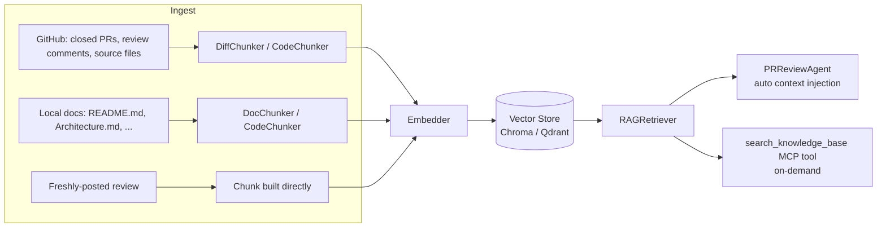

# RAG (Retrieval-Augmented Generation)

The RAG pipeline lives entirely under [rag/](rag/) and gives both agents (`ChatAgent`, `PRReviewAgent`) access to a project-specific knowledge base: past PR diffs, past review comments, indexed source files, and local docs — so reviews can reference historical context and conventions instead of judging a diff in isolation.

## Folder structure

```text
rag/
├── chunk.py                              # Chunk dataclass — the unit stored/retrieved
├── chunker/
│   ├── base.py
│   ├── code_chunker.py                   # splits source files into chunks
│   ├── diff_chunker.py                   # splits PR diffs into chunks
│   └── doc_chunker.py                    # splits prose docs (README, etc.) into chunks
├── embedder/
│   ├── base.py
│   ├── local_embedder.py                 # sentence-transformers, offline (default)
│   └── openai_embedder.py                # OpenAI text-embedding-3-small
├── vector_store/
│   ├── base.py
│   ├── chroma_store.py                   # ChromaDB, persisted at .rag_db/ (default)
│   └── qdrant_store.py                   # Qdrant alternative
├── ingestion/
│   ├── github_ingester.py                # closed PRs, review comments, source files, new reviews
│   └── doc_ingester.py                   # local prose/code docs (README.md, Architecture.md, ...)
└── retriever.py                          # RAGRetriever — the query-side API
```

Everything is wired together in `core/adapter_factory.py:get_rag_components()` (called from `main.py`, `core/temporal_workflows.py`, and `scripts/ingest.py`).

## Data flow



## The `Chunk` type (`rag/chunk.py`)

```python
@dataclass
class Chunk:
    chunk_id: str
    text: str
    source_type: str   # "diff" | "source_file" | "review_comment" | "doc" | "commit"
    repo_name: str
    metadata: dict
    embedding: list[float]
```
`to_metadata_dict()` flattens `metadata` into primitives only (str/int/float/bool), since ChromaDB metadata can't hold nested structures.

## Embedding providers

Selected via `RAG_EMBEDDER` (`config/settings.py:44`):

- **`local`** (default) — [rag/embedder/local_embedder.py](rag/embedder/local_embedder.py): `sentence-transformers` model `all-MiniLM-L6-v2`, 384-dim, normalized for cosine similarity. Lazy-loaded on first use and cached process-wide (`_MODEL_CACHE`) so repeated `LocalEmbedder()` construction (a fresh one per review activity) doesn't re-touch the Hugging Face Hub every time. First download requires network access to Hugging Face — see the README's "Hugging Face Token" section for avoiding rate-limit slowdowns on a cold worker.
- **`openai`** — [rag/embedder/openai_embedder.py](rag/embedder/openai_embedder.py): `text-embedding-3-small`, 1536-dim, called via raw `httpx` (no `openai` SDK dependency). Falls back to `local` automatically if `OPENAI_API_KEY` isn't set (`adapter_factory.py:93-100`).

## Vector store

Selected via `RAG_VECTOR_STORE` (`config/settings.py:45`):

- **`chroma`** (default) — [rag/vector_store/chroma_store.py](rag/vector_store/chroma_store.py): `chromadb.PersistentClient(path=RAG_DB_PATH)`, single collection named `pr_review_knowledge`, `hnsw:space="cosine"`. This is the source of `.rag_db/chroma.sqlite3`.
- **`qdrant`** — [rag/vector_store/qdrant_store.py](rag/vector_store/qdrant_store.py), configured via `QDRANT_URL` / `QDRANT_API_KEY`.

Queries pass `filter={"repo_name": repo_name}` so a multi-repo deployment doesn't leak context across repositories, even though they currently share one collection (see [IMPROVEMENTS.md](IMPROVEMENTS.md)).

## Retrieval: two distinct paths

Both are implemented by `RAGRetriever` ([rag/retriever.py](rag/retriever.py)) and share `_compress_and_format()` for token-budget-aware output.

### 1. Automatic, pre-LLM context injection

Used by `PRReviewAgent.review_pr()` (`core/agent.py:82-97`) and `ChatAgent._maybe_retrieve_rag_context()` (`core/chat_agent.py:107-149`, gated by a keyword heuristic so RAG isn't queried on every chat turn).

`RAGRetriever.retrieve(diff_text, repo_name)` ([retriever.py:62](rag/retriever.py#L62)):
1. Returns `""` immediately if the store is empty (`self._store.count() == 0`).
2. `_build_query(diff_text)` ([retriever.py:132](rag/retriever.py#L132)) — extracts changed file paths (`+++ b/...` lines) and up to 20 added lines to build a compact query string.
3. Embeds the query, queries the vector store with `top_k=RAG_TOP_K` filtered by `repo_name`.
4. `_deduplicate()` — keeps only the highest-ranked chunk per file for `source_file` chunks (review comments/diffs are kept as-is).
5. `_compress_and_format()` ([retriever.py:176](rag/retriever.py#L176)) — a `token_budget` (default 2000 tokens, estimated as `len(text) // 4`) is filled from the highest-ranked chunk down; chunks that would overflow the budget are truncated with a `[...truncated]` marker, and a summary header reports how many chunks were fully included vs. truncated/omitted.

The result is capped again by `settings.MAX_RAG_CONTEXT_CHARS` (default 4000 chars) in `core/agent.py:91-92` before being spliced into the system prompt.

### 2. On-demand, via the `search_knowledge_base` MCP tool

`RAGRetriever.retrieve_for_query(query, repo_name)` ([retriever.py:104](rag/retriever.py#L104)) backs the `search_knowledge_base` tool ([mcp_server/tools/rag_tools.py:21](mcp_server/tools/rag_tools.py#L21) — see [MCP.md](MCP.md)). This lets the LLM proactively pull context mid-ReAct-loop instead of relying only on what was injected up front — useful when the diff alone doesn't give enough context. If the store is empty, it returns a human-readable message instead of an empty string, since this path's output is shown directly to the LLM as a tool result.

## Auto re-ingestion after a review

After `PRReviewAgent` successfully posts a review, it calls `GitHubIngester.ingest_review_result()` ([rag/ingestion/github_ingester.py:141](rag/ingestion/github_ingester.py#L141)) to embed and store the general comment plus each inline comment as new `review_comment` chunks — so future reviews (on this or related PRs) can find and reference it. This call is wrapped in `PRReviewAgent._run_with_heartbeat()` (see [HOW_IT_WORKS.md](HOW_IT_WORKS.md)) since it can trigger the same cold-start embedding-model load as step 1.

## Bulk ingestion (`scripts/ingest.py`)

Standalone CLI for seeding the knowledge base before reviews start using it:

```bash
python scripts/ingest.py <owner/repo> [branch] [local_path]
```

Runs, in order:
1. `GitHubIngester.ingest_closed_prs(repo_name, max_prs=RAG_INGEST_CLOSED_PRS)` — closed/merged PR diffs + their review comments.
2. `GitHubIngester.ingest_source_files(repo_name, branch)` — current source files matching a fixed set of extensions (`.py`, `.js`, `.ts`, `.go`, `.md`, ... — see `_SOURCE_EXTENSIONS` in `github_ingester.py`).
3. `DocIngester.ingest_directory(...)` ([rag/ingestion/doc_ingester.py](rag/ingestion/doc_ingester.py)) — only if a local checkout of the repo happens to exist in the current working directory; walks it (skipping `venv`/`__pycache__`/hidden dirs) and ingests `.md`/`.txt`/`.rst`/code files.

## Configuration reference (`config/settings.py:42-49`, mirrored in `.env.example`)

| Setting | Default | Meaning |
|---|---|---|
| `RAG_ENABLED` | `true` | Master switch — when `false`, `get_rag_components()` returns `(None, None)` and no RAG tool/context is wired in anywhere. |
| `RAG_DB_PATH` | `./.rag_db` | Chroma persistence directory. |
| `RAG_EMBEDDER` | `local` | `local` \| `openai`. |
| `RAG_VECTOR_STORE` | `chroma` | `chroma` \| `qdrant`. |
| `RAG_TOP_K` | `5` | Chunks fetched per query, before dedup/compression. |
| `RAG_INGEST_CLOSED_PRS` | `50` | Max closed PRs pulled per `scripts/ingest.py` run. |
| `MAX_RAG_CONTEXT_CHARS` | `4000` | Hard cap on injected RAG context size in `core/agent.py` (separate from `RAGRetriever`'s own ~2000-token budget). |
| `QDRANT_URL` / `QDRANT_API_KEY` | `""` | Only used when `RAG_VECTOR_STORE=qdrant`. |
